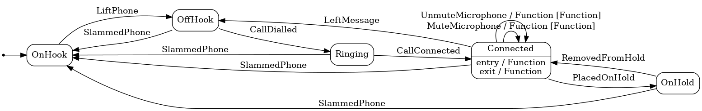

# State Machines

A state machine is a programming architecture that allows dynamic flow to states depending on values from previous states or user inputs. This architecture is suitable for applications that can be described as a combination of: States. Decision-making logic that determines when to move to a particular state.

This project showcases the powerful ability of the [Stateless](https://github.com/dotnet-state-machine/stateless) library for modeling State Machines in .Net.

## Example State Machine

## Showcased abilities

* Example State Machine interaction
* Dynamic State Machine generation
* Exporting State Machines as Images with the [Graphviz CLI](https://graphviz.org/)
