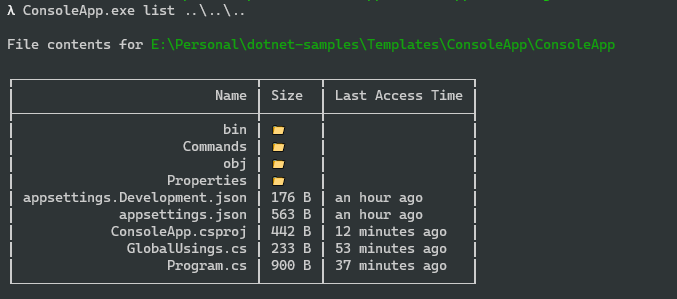
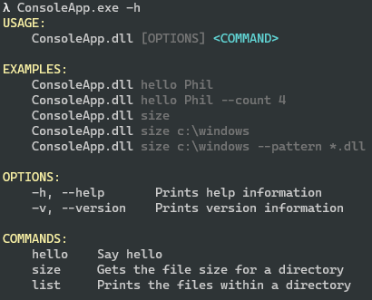
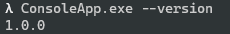

# Command based Console App

This project showcases the simplicity of the `Spectre.Console` and `Spectre.Console.Cli` packages. This packages allow
you to easily create expansive command line user interfaces with automatic parameter reading and help menu generation.

To view this demo, build the project and invoke the CLI help menu with `.\ConsoleApp.exe -h` to see the available
commands.

Packages:

* [Spectre.Console](https://github.com/spectreconsole/spectre.console) - [Docs](https://spectreconsole.net/)
* [Humanizer](https://github.com/Humanizr/Humanizer)

Examples:

List command

Help command

Version command

